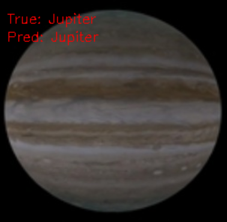
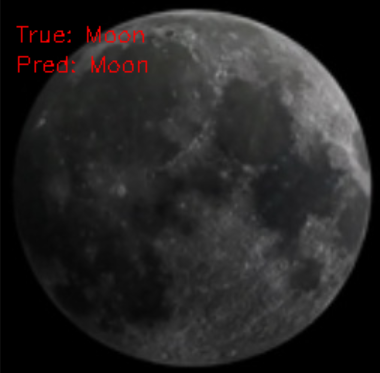

# Planets and Moons Classification

This project is a machine learning application that classifies images of planets and moons using a convolutional neural network (CNN) built with LibTorch (PyTorch C++ API) and OpenCV. The dataset used is the [Planets and Moons Dataset - AI in Space](https://www.kaggle.com/datasets/emirhanai/planets-and-moons-dataset-ai-in-space) from Kaggle.

## Table of Contents

- [Project Overview](#project-overview)
- [Project Structure](#project-structure)
- [Installation](#installation)
- [Dataset Preparation](#dataset-preparation)
- [Building the Project](#building-the-project)
- [Usage](#usage)
  - [Processing Images](#processing-images)
  - [Training the Model](#training-the-model)
  - [Visualizing Predictions](#visualizing-predictions)

## Project Overview

The goal of this project is to:

- **Process and prepare images** for training by cropping and resizing them.
- **Train a CNN model** to classify images of planets and moons.
- **Visualize predictions** made by the trained model on test images.

## Project Structure

```plaintext
📂
├── 📂 scripts
│   ├── 📄 process_images.cpp
│   └── 📄 visualize_predictions.cpp
├── 📂 src
│   ├── 📄 main.cpp
│   ├── 📄 dataset.h
│   ├── 📄 model.h
│   ├── 📄 model.cpp
│   ├── 📄 utils.h
│   └── 📄 utils.cpp
├── 📄 CMakeLists.txt
└── 📄 README.md
`````
- scripts/: Contains utility scripts for processing images and visualizing model predictions.
- src/: Contains the main application source code and related headers.
- CMakeLists.txt: Build configuration for CMake.
- README.md: Project documentation.

## Installation
### 1. Clone the Repository
```
git clone https://github.com/yourusername/planets-and-moons-classification.git
cd planets-and-moons-classification
```
### 2. Install Dependencies
Ensure that LibTorch and OpenCV are installed on your system.

### 3. Set Environment Variables (Windows)
If you're on Windows and using Visual Studio, make sure to set the `CUDA_TOOLKIT_ROOT_DIR` in the `CMakeLists.txt` if you plan to use CUDA.

## Dataset Preparation

1. **Download the Dataset**: Planets and Moons Dataset - AI in Space from Kaggle:
   https://www.kaggle.com/datasets/emirhanai/planets-and-moons-dataset-ai-in-space

2. **Extract the Dataset**: Place the extracted dataset in a directory of your choice.

## Building the Project

### 1. Create a Build Directory

```bash
mkdir build
cd build
```
### 2. Configure the Project with CMake
```bash
cmake ..
```

### 3. Build the Project
```bash
cmake --build . --config Release
```

## Usage

### Processing Images
Before training, you need to preprocess the images:

```bash
./ProcessImages <input_folder> <output_folder>
```
This script crops and resizes images to a consistent size suitable for training.

### Training the Model

Run the main application to train the model:
```bash
./Planets_and_Moons [options]
```

Available Options
- --train_ratio <float>: Training data ratio (default: 0.7).
- --val_ratio <float>: Validation data ratio (default: 0.15).
- --batch_size <int>: Batch size (default: 8).
- --num_workers <int>: Number of worker threads (default: 2).
- --num_epochs <int>: Number of training epochs (default: 10).
- --learning_rate <float>: Learning rate (default: 1e-4).
- --base_path <string>: Path to the processed dataset.
- --best_model_path <string>: Path to save the best model (default: best_model.pt).

Example
```
./Planets_and_Moons --base_path "/path/to/processed/data" --num_epochs 20 --batch_size 16
```


### Visualizing Predictions

After training, you can visualize the model's predictions on the test set:
```bash
./VisualizePredictions [options]
```

Available Options
- --train_ratio <float>: Training data ratio used during training (default: 0.7).
- --val_ratio <float>: Validation data ratio used during training (default: 0.15).
- --base_path <string>: Path to the processed dataset.
- --best_model_path <string>: Path to save the best model (default: best_model.pt).

Example
```
./VisualizePredictions --base_path "/path/to/processed/data" --best_model_path "best_model.pt"

```
<p align="center">
  
  
</p>
